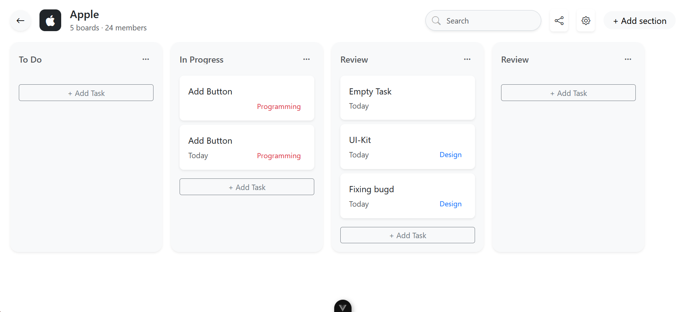

# Kanban Board App

A modern and responsive Kanban Board application built using **Vue.js** and **Bootstrap**. This project allows users to manage tasks across different stages like *To Do*, *In Progress*, and *Done* using a sleek and intuitive drag-and-drop interface.

## 🔧 Features

* 📝 Create, update, and delete tasks
* 📌 Drag-and-drop tasks between columns
* 🌐 Responsive UI with Bootstrap
* 💾 Local storage support for data persistence
* 🧩 Modular Vue components for easy maintenance

## 🖥️ Tech Stack

* **Frontend:** Vue.js 3, Bootstrap 5
* **Build Tool:** Vite

## 📁 Project Structure

```
kanban-board-app/
├── public/
├── src/
│   ├── assets/
│   ├── components/
│   ├── views/
│   ├── App.vue
│   └── main.js
├── index.html
└── vite.config.js
```

## 🛠️ Setup Instructions

```bash
# Clone the repository
git clone https://github.com/rithish72/Kanban-Board-App.git
cd Kanban-Board-App

# Install dependencies
npm install

# Run the app in development mode
npm run dev

# Build for production
npm run build
```

## 📸 Screenshots



## 📌 Future Improvements!

* User authentication and login
* Backend integration (e.g., Firebase or Node.js API)
* Task deadlines and notifications
* Dark mode toggle

---
